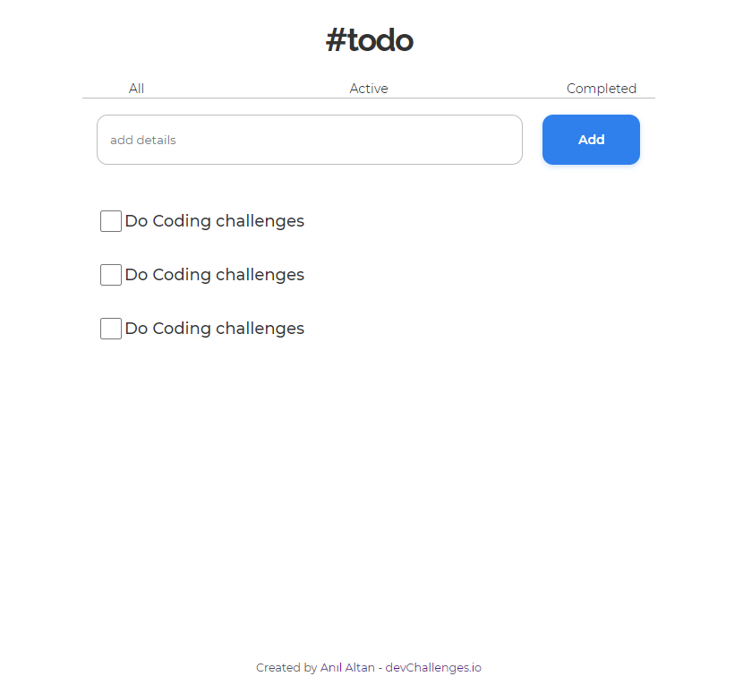

<!-- Please update value in the {}  -->

<h1 align="center">To do app</h1>

<div align="center">
   Solution for a challenge from  <a href="http://devchallenges.io" target="_blank">Devchallenges.io</a>.
</div>

<div align="center">
  <h3>
    <a href="http://altananil.com/react-to-do-app/">
      Demo
    </a>
    <span> | </span>
    <a href="https://github.com/anilaltan/react-to-do-app">
      Solution
    </a>
    <span> | </span>
    <a href="https://devchallenges.io/challenges/3JFYedSOZqAxYuOCNmYD">
      Challenge
    </a>
  </h3>
</div>

<!-- TABLE OF CONTENTS -->

## Table of Contents

- [Overview](#overview)
  - [Built With](#built-with)
- [Features](#features)
- [How to use](#how-to-use)
- [Contact](#contact)

<!-- OVERVIEW -->

## Overview



Introduce your projects by taking a screenshot or a gif. Try to tell visitors a story about your project by answering:

- Where can I see your demo?
- You can see it by clicking this address.(http://altananil.com/react-to-do-app/)
- What was your experience?
- I have completely built a page on my own and have practiced my knowledge
- What have you learned/improved?
- Reinforced my JavaScript and React knowledge

### Built With

<!-- This section should list any major frameworks that you built your project using. Here are a few examples.-->

- [Javascript](https://www.javascript.com/)
- [React](https://reactjs.org/)
- [Html](https://html.com/)
- [CSS](https://www.w3.org/Style/CSS/)

## Features

<!-- List the features of your application or follow the template. Don't share the figma file here :) -->

This application/site was created as a submission to a [DevChallenges](https://devchallenges.io/challenges) challenge. The [challenge](https://devchallenges.io/challenges/TtUjDt19eIHxNQ4n5jps) was to build an application to complete the following user stories:

- [x] User story: I can add a new task
- [x] User story: I can complete a task
- [x] User story: I can toggle between All, Active and Completed
- [x] User story: I can remove one or all tasks under the Completed tab
- [x] User story (optional): Store the data in local storage that when I refresh the page I can still see my progress

## How To Use

To clone and run this application, you'll need [Git](https://git-scm.com) and [Node.js](https://nodejs.org/en/download/) (which comes with [npm](http://npmjs.com)) installed on your computer. From your command line:

```bash
# Clone this repository
$ git clone https://github.com/anilaltan/react-to-do-app

# Install dependencies
$ npm install

# Run the app
$ npm start
```

## Contact

- Website [altananil.com](http://altananil.com/)
- GitHub [@anilaltan](https://github.com/anilaltan)
- Twitter [@altn_anl](https://twitter.com/altn_anl)
